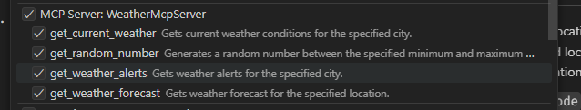
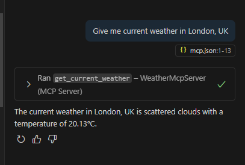

# Real Weather MCP Server

The app provides current weather information and weather forecast via MCP interface.

## Supported Tools
1. `GetCurrentWeather` - Get current weather for a specified location
2. `GetWeatherForecast` - Get weather forecast for a specified location
3. `GetWeatherAlerts` - Get weather alerts/warnings for a location 

All methods use the same input parameters - `city` and `countryCode` (optional).

## How to Setup

### OpenWeatherMap API Keys

The app uses OpenWeatherMap API under the hood, so it's necessary to provide your own API key to have the service working. There are 2 ways to do that:
* if the app is running in Kubernetes, put `OpenWeatherMapApiKey` into a secret and attach it to the pods.
* the other universal way is to set the same environment variable for the application environment.

To get the API key from OpenWeatherMap you need to:

* sign up in https://openweathermap.org/
* go to My API key profile area, copy API key there.

It would be better to create a separate API key to use in the app with a meaningful name.

**NOTE 1**: Please also be aware that the API key can be not yet activated for hours.

**NOTE 2**: For `GetCurrentWeather` you can use a free tier API key. For 2 others you will need `One Call API 3.0` subscription.

## How to Run

The app is not yet published as a NuGet package is it's a simple demo so the app can be built and run from the sources. For that follow the steps:

* Open the app in Visual Studio Code. You need to install all the updates in advance and setup GitHub Copilot extension.
* Switch Copilot to Chat mode
* Change Built-in mode from Ask to Agent
* Button Tools will be marked as having a one another tool to setup. Press Refresh.
* If everything is done properly, the Select tool dropdown shows 3 weather methods (Image 1).
* To test the app ask Copilot `Give me current weather in London, UK`. Image 2 is the expected result.

Image 1: Methods provided by the MCP server.

Image 2: A sample request execution.

Thanks for reading! 🌤️